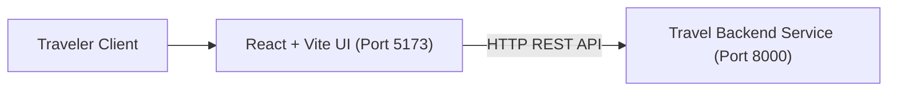
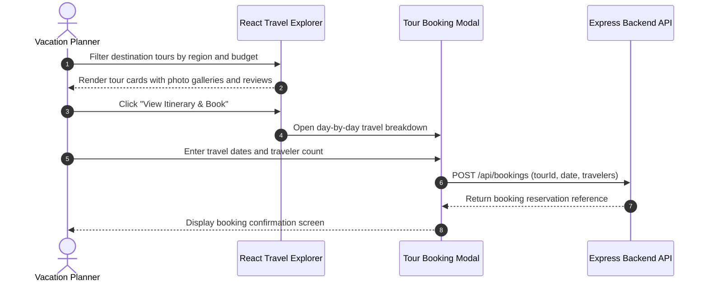

# Voyage Explorer — Interactive Travel Booking Frontend
[]()
[]()
[]()
[]()

## Overview
Voyage Explorer is an interactive travel and destination exploration web application built with React, Vite, and Tailwind CSS. Developed as an end-semester practical project, it offers responsive destination search, vacation itinerary inspection, user booking inquiries, and integration with travel backend services.

- **Problem Solved:** Responsive destination discovery and travel itinerary planning.
- **Target Users:** Travelers, vacation planners, and travel agency clients.
- **Current Status:** Functional Frontend Application.

## Features
- **Destination Catalog:** Search and filter destinations by region, price range, and duration.
- **Interactive Tour Cards:** Detailed highlights, day-by-day itineraries, and customer ratings.
- **Booking Modal:** Modal form for customer reservations and contact details.
- **Responsive Layout:** Optimized for mobile phones, tablets, and desktop displays.

## Architecture


## User Flow


## Technology Stack
| Layer | Technology | Purpose |
|---|---|---|
| Framework | React 18, Vite | Component-driven user interface |
| Styling | Tailwind CSS | Modern travel UI and responsive grid |
| State & Routing | React Hooks | Application state and interactive modals |

## Infrastructure
- **Development Port:** 5173
- **Target API Port:** 8000 (VoyageFlix Backend)

## Project Structure
```text
end_sem_lab/
├── src/
│   ├── components/      # Navbar, DestinationCard, BookingModal, Hero
│   ├── assets/          # Travel images and banners
│   ├── App.jsx          # Root view and state
│   └── main.jsx         # React application entry
├── index.html           # HTML template
├── package.json         # Dependencies
├── vite.config.js       # Vite configuration
├── .gitignore           # Git ignore definitions
└── README.md            # Technical documentation
```

## Prerequisites
- Node.js >= 18.x
- npm >= 9.x

## Environment Variables
Copy `.env.example` to `.env` and configure placeholders:
```env
VITE_BACKEND_URL=http://localhost:8000
```

## Local Development Setup
1. Clone the repository:
   ```bash
   git clone https://github.com/Bhanutejanallamothu/end_sem_lab.git
   cd end_sem_lab
   ```
2. Install dependencies:
   ```bash
   npm install
   ```
3. Start development server:
   ```bash
   npm run dev
   ```
4. Access application at `http://localhost:5173`.

## Docker Setup
*Not detected in repository. Deployable as static SPA.*

## Database Setup
*Not applicable. Frontend interacts with backend API.*

## API Documentation
Consumes the following backend endpoints:
- `GET /api/packages` - Fetches destination list.
- `POST /api/bookings` - Submits reservation.

## Deployment
Build static assets:
```bash
npm run build
```
Deploy the `dist/` directory to Vercel, Netlify, or AWS S3.

## Security
- Input validation on reservation forms.
- Safe rendering of destination descriptions.

## Testing
Run build verification:
```bash
npm run build
```

## Troubleshooting
- **API CORS Errors:** Ensure target backend allows requests from `http://localhost:5173`.

## Future Improvements
- Live currency converter for international travelers.

## License
Academic project. All rights reserved by repository owner.
